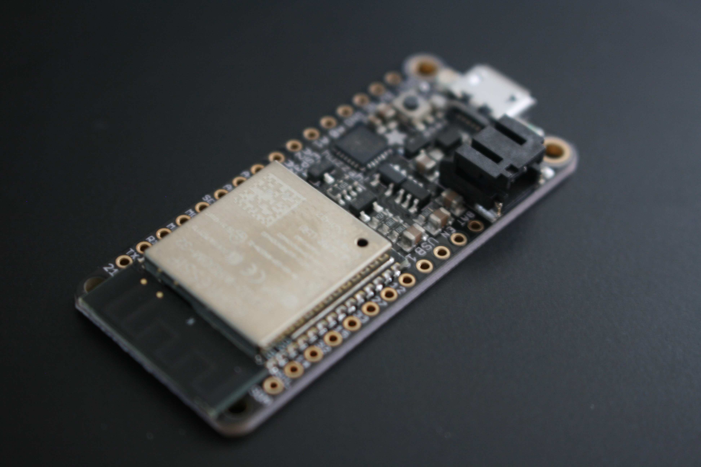

&emsp; I've recently acquired a new microcontroller board to start working on a personal project (more info about that later). Link to the board: [Adafruit HUZZAH32](https://learn.adafruit.com/adafruit-huzzah32-esp32-feather).

The board is equipped with a dual-core ESP32 from Espressif, featuring 4MB of SPI flash, and a tuned antenna. What I'm really looking forward to is the WiFi and Bluetooth capabilites.

## The Project

In the next month, I plan on creating an adaptive LED lighting "system" (system in quotes because this could just be a simple LED strip). The HUZZAH32 seems to contain all elements that I'll need for such a system. 

### Some initial requirements:
- Must have PWM over GPIO.
- Ability to sync clock over WiFi.
- Arduino IDE support.
- Low power usage under normal operation.

Obviously this isn't an extensible list but the HUZZAH32 price point and specifications hit the sweet spot for me. Hopefully the project can succeed without further research into available microcontroller boards. 

Next up, I'll be selecting LED lighting (probably in the form of a strip) and an elegant way to power both the 5V HUZZAH and a 12V LED light source. Look for an actual Blog Post in the future.

